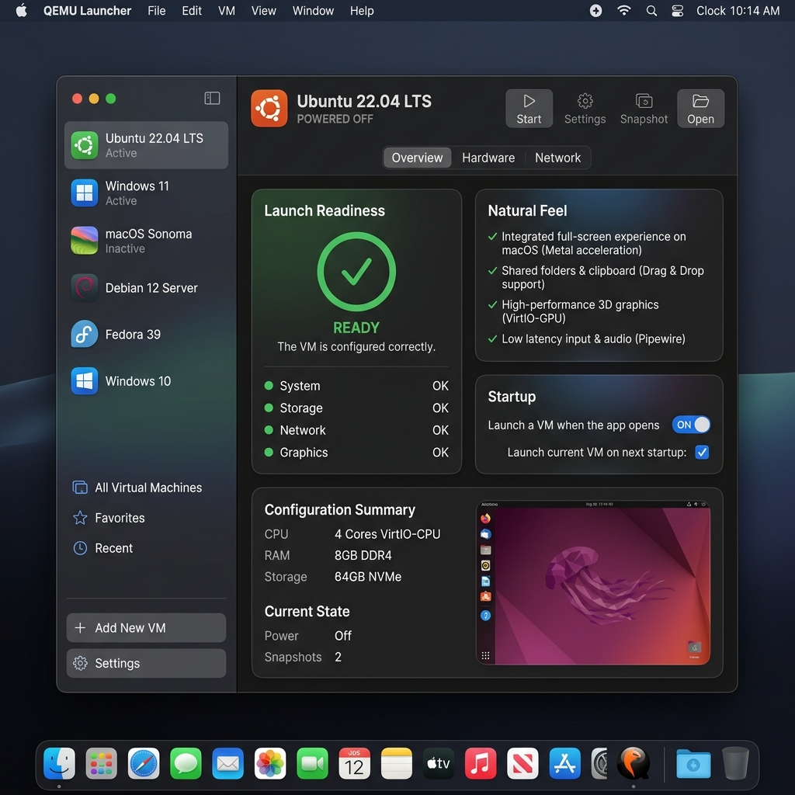
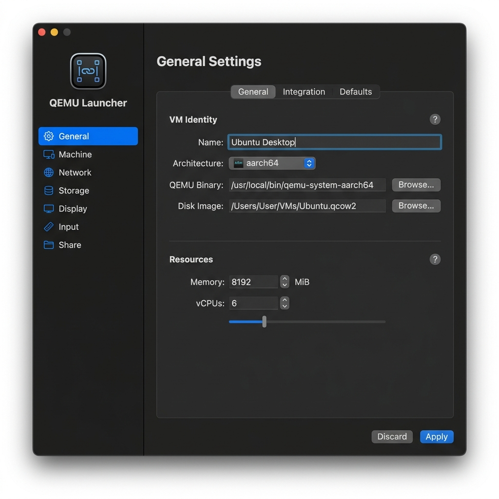
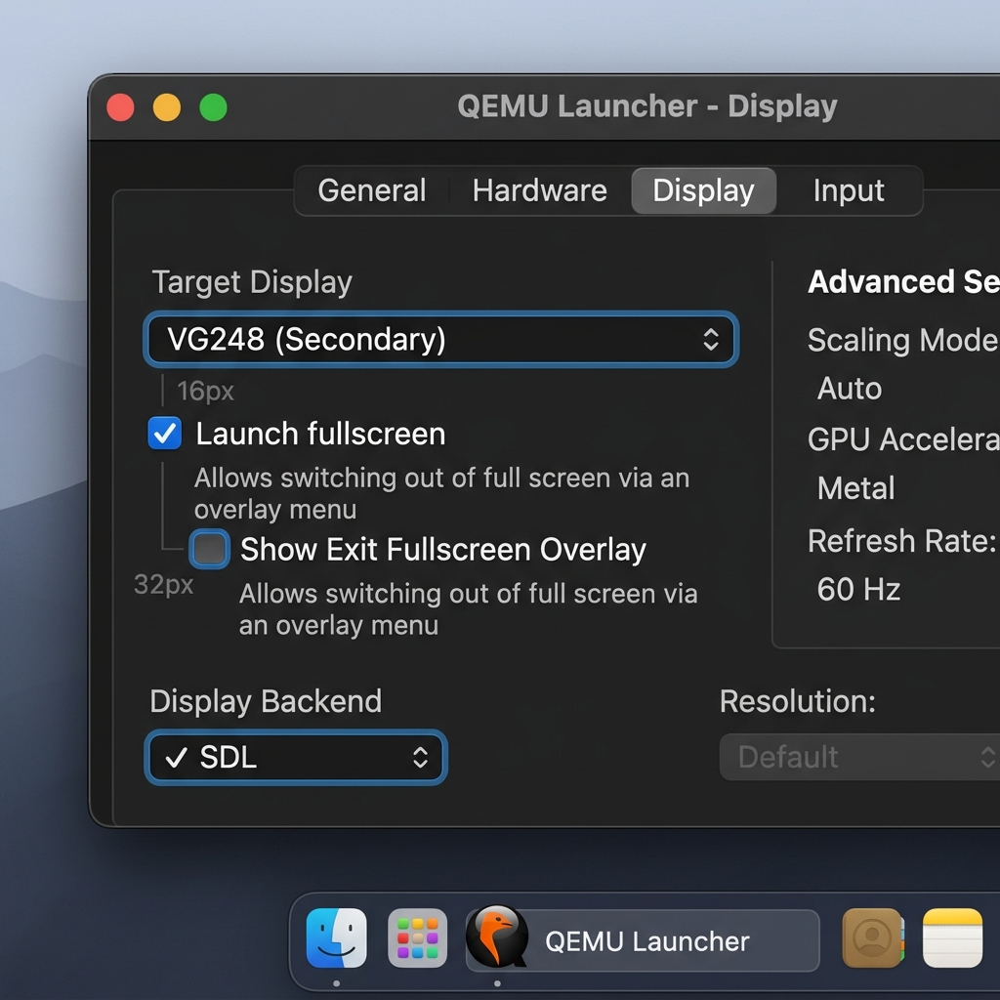
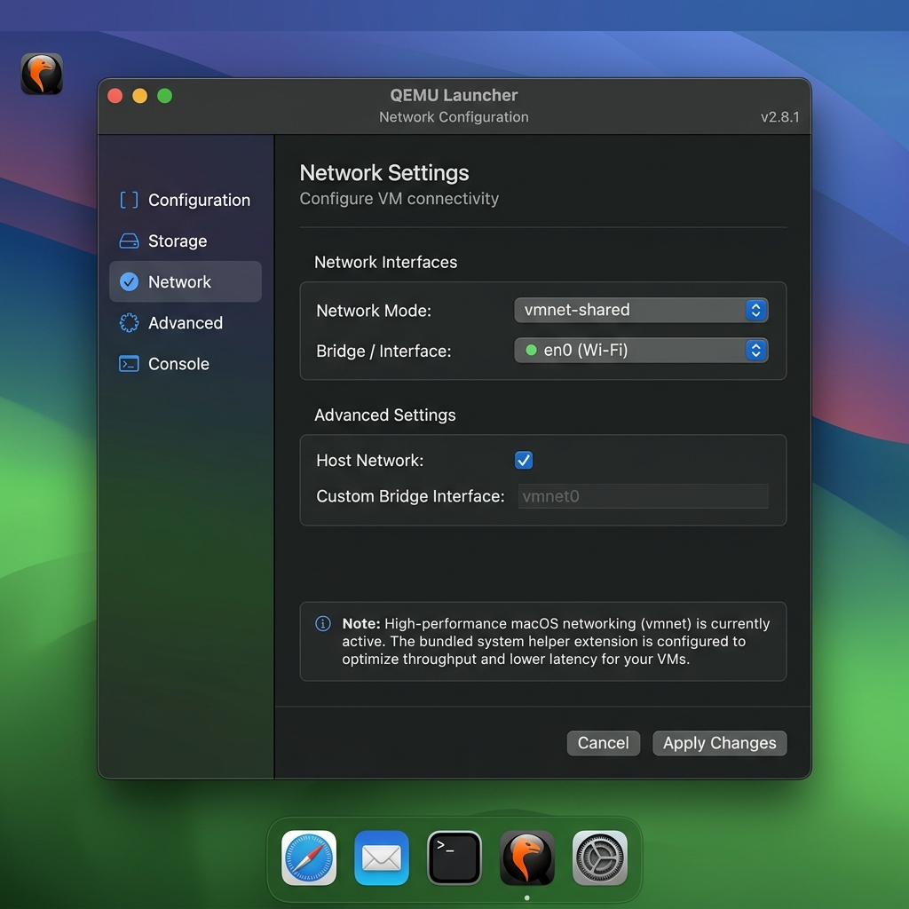

# QEMU Launcher

A premium, native-feeling virtualization manager for macOS and Linux. QEMU Launcher provides a streamlined interface for managing high-performance VMs with native-grade monitor placement, seamless networking, and a state-of-the-art UI.

## 📸 UI Preview

<p align="center">
  
  
</p>
<p align="center">
  
  
</p>

## 🚀 Key Features

*   **Premium macOS Experience**: Optimized for Apple Silicon and Intel, featuring native window management and multi-monitor support.
*   **Seamless Networking**: High-performance `vmnet-shared` and `bridged` networking using a bundled privileged helper—no root passwords required after a one-time setup.
*   **Intelligent Display Placement**: Automatically moves and resizes VMs to your chosen monitor, including secondary screens, without the dreaded macOS "ding" sound.
*   **Auto-Resume**: Remembers your VM state and automatically resumes where you left off.
*   **Native UI Overlays**: Hidden "Hot Edge" triggers and elegant exit menus that stay visible even in greedy fullscreen modes.
*   **Shared Folders**: Integrated support for `virtio-9p` and `virtiofs` for high-speed file sharing between host and guest.
*   **QMP Integration**: Real-time status monitoring and graceful power management via the QEMU Machine Protocol.

## 📦 Installation (macOS)

1.  **Download the DMG**: Open the `QEMU Launcher.dmg`.
2.  **Drag to Applications**: Move the app to your `/Applications` folder.
3.  **Launch**: Open the app. 
4.  **One-Time Setup**: If you choose high-performance networking (`vmnet`), the app will ask for your administrator password **once** to install its internal networking helper. After this, all launches are instant and password-free.

## 🛠 Usage

*   **Select a VM**: Use the sidebar to switch between your configured profiles.
*   **Configure**: Set your CPU, Memory, and target Display.
*   **Launch**: Click the "Launch" button.
*   **Exit Fullscreen**: Move your mouse to the **top-center** of the screen to reveal the "Exit Fullscreen" menu.

## 🏗 Architecture & Testing

*   **[Architecture Documentation](ARCHITECTURE.md)**: Deep dive into networking, window management, and security.
*   **[Testing Framework](TESTING.md)**: Details on local unit tests and remote hardware validation.

## 💻 Development

### Prerequisites
*   Python 3.12+
*   QEMU installed (`brew install qemu` or `apt install qemu-system`)
*   `wmctrl` (Linux only, for display placement)

### Build from Source
```bash
# Clone the repository
git clone https://github.com/your-repo/QEMULauncher.git
cd QEMULauncher

# Install dependencies
pip install -r requirements.txt

# Build the macOS app bundle
./build.sh
```

---
Built with ❤️ for the QEMU community.
